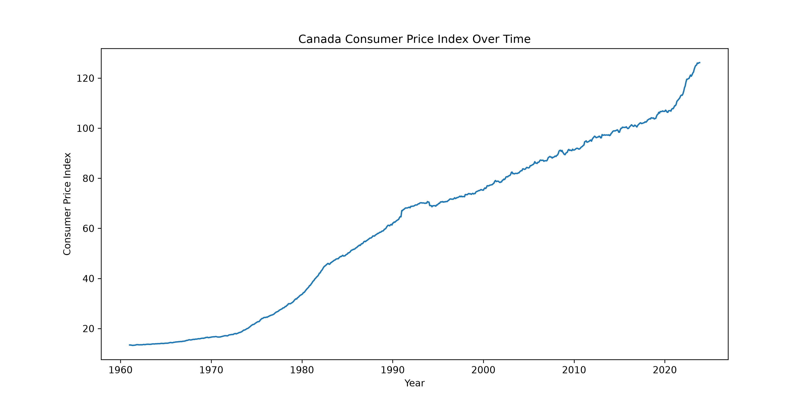
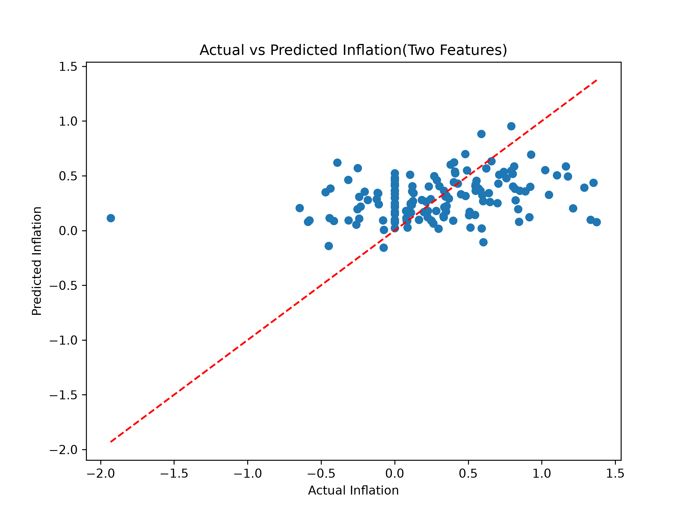

# Canadian Inflation Analysis

**Jinran Cheng** · Python data science portfolio

Combine Canadian economic indicators and evaluate how much monthly inflation can be explained by simple linear models.

**Skills demonstrated:** Data cleaning · time-series exploration · dataset joins · regression evaluation

## Results and interpretation

| Model | MAE | RMSE | R² |
|---|---:|---:|---:|
| Unemployment only | 0.363 | 0.466 | -0.002 |
| Unemployment + interest rate | 0.334 | 0.445 | 0.089 |

Adding interest rates improved the recorded fit, but explanatory power remained limited. A weak baseline is a useful finding: these variables alone do not explain most month-to-month inflation variation.

Metrics above are rounded from the original saved analysis; they are not newly benchmarked results.

## Explore the analysis

- [01 understanding data](notebooks/01_understanding_data.ipynb)
- [02 data cleaning EDA](notebooks/02_data_cleaning_EDA.ipynb)
- [03 annual cpi analysis](notebooks/03_annual_cpi_analysis.ipynb)
- [04 merge dataset](notebooks/04_merge_dataset.ipynb)
- [05 multiple linear regression](notebooks/05_multiple_linear_regression.ipynb)

The numbered notebooks document the workflow, from data exploration to modeling. Saved outputs let you review the analysis directly on GitHub.

## Selected visualizations





## Run locally

1. Clone this repository and open its folder.
2. Create an environment and install dependencies:

```bash
python -m venv .venv
source .venv/bin/activate  # Windows: .venv\Scripts\activate
python -m pip install -r requirements.txt
mkdir -p data/raw
python -m jupyter lab
```

3. Obtain the data described below and place it in `data/raw/`.
4. Open the notebooks from their notebook folder and run cells from top to bottom. Relative data paths assume that working directory. For projects with multiple notebooks, follow their numeric order; each loads its own source data.

### Dataset

FRED series CPALCY01CAM661N (CPI), LRUNTTTTCAM156S (unemployment), and IRSTCB01CAM156N (interest rate). Export CSV files as cpi_canada.csv, unemployment_canada.csv and interest_rate_canada.csv in data/raw/. Preserve observation_date and the original series-ID column names.

Raw datasets are not redistributed here. Use the original provider's terms and permissions. Results may vary with dataset versions and package versions. Dependencies list the directly used libraries; a fully locked environment has not been validated.

## Limitations and next steps

The notebooks use a random train/test split and contemporaneous indicators. These results describe historical associations, not validated forecasts or causal effects. A chronological split, lagged features and a naive baseline are the next evaluation steps.

## Project structure

- `README.md`: project overview, results and setup
- `requirements.txt`: direct Python dependencies
- `notebooks/`: documented analysis and saved outputs
- `images/`: selected plots
- `data/raw/`: local source datasets (excluded from Git)
